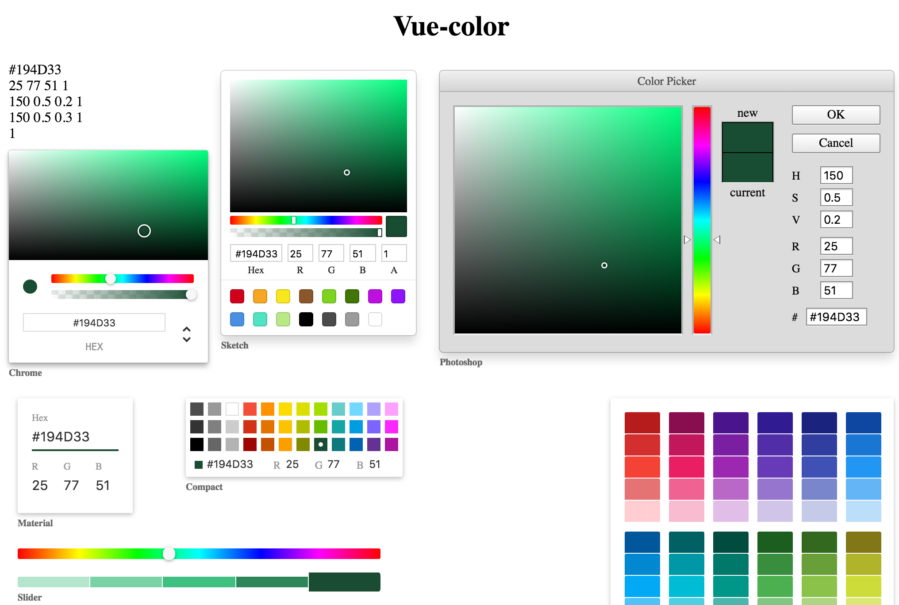

# vue-color-sketch

[](https://www.npmjs.com/package/vue-color-sketch)

Color Pickers for Sketch with Vue.js(vue2.0).  

## [Live demo](https://flpvn.github.io/vue-color-sketch/)



## Installation

### NPM
```bash
$ npm install vue-color-sketch
```

### CommonJS
```js
var Sketch = require('vue-color/src/Sketch.vue');

new Vue({
  components: {
    'sketch': Sketch
  }
})
```

### ES6
```js
import { Sketch } from 'vue-color-sketch'

new Vue({
  components: {
    'sketch-picker': Sketch
  }
})
```

### Browser globals
The `dist` folder contains `vue-color.js` and `vue-color.min.js` with all components exported in the <code>window.VueColor</code> object. These bundles are also available on NPM packages.

```html
<script src="path/to/vue.js"></script>
<script src="path/to/vue-color.min.js"></script>
<script>
  var Sketch = VueColor.Sketch
</script>
```

## Local setup

```
npm install
npm run dev
```

## Usage

```js

var colors = {
  hex: '#194d33',
  hsl: { h: 150, s: 0.5, l: 0.2, a: 1 },
  hsv: { h: 150, s: 0.66, v: 0.30, a: 1 },
  rgba: { r: 25, g: 77, b: 51, a: 1 },
  a: 1
}
// or
var colors = '#194d33'
// or 
var colors = { h: 150, s: 0.66, v: 0.30 }
// or 
var colors = { r: 255, g: 0, b: 0 }
// etc...

new Vue({
  el: '#app',
  components: {
    'sketch-picker': sketch
  },
  data () {
    return {
      colors
    }
  }
})

```

`colors` accepts either a string of a hex color '#333' or a object of rgb or hsl values `{ r: 51, g: 51, b: 51 }` or `{ h: 0, s: 0, l: .10 }`, whatever [tinycolor2](https://www.npmjs.com/package/tinycolor2) accepts as an input.

```html
<!-- suppose you have the data 'colors' in your component -->
<sketch-picker v-model="colors" />
```

OR

```html
<sketch-picker :value="colors" @input="updateValue"></sketch-picker>
```

## License

vue-color is licensed under [The MIT License](LICENSE).
